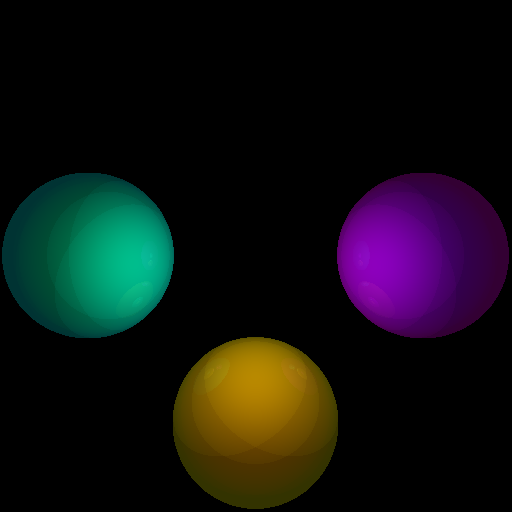
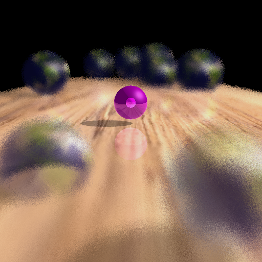

# Ray Tracer
#### This is a readme file created by Junyue Tao about the ray-tracing program

---

**Additional changes have been made compared to the previous version 1c:**
1. Now the program can recursively trace the reflective light with user customed depth
2. The program can also recursively trace the refracted light
3. The program now can enable depth of field effect

---

## Build
The provided file includes a CMake file named CMakeList.txt.

The recommended CMake version on Windows is v3.13 or higher, as new features of CMake related to Visual Studio are released on that version. The version below 3.13 may lead to issues like being unable to set read-in file names using CMake stript.

---

### Build on Ubuntu
To build on Ubuntu, first, build using
```
cmake .
```
Then it will auto-generate Makefile on Ubuntu. Continue to execute the following command inside the terminal
```
make all
or
make
```
It will generate an executable file called raytracer. Use
```
./Raytracer <input_setting_file_name> <output_file_name> <alternative flag>
```
to execute the program.

### Obtain the output ppm file
The output ppm file will be at the same location as the program root file, named *"default_output.ppm"*.

---

### Build on Windows
To build on Windows, it is recommended to create an additional folder for auto-generated files and VS solution files, use the following command
```
mkdir build
cd build
cmake ..
```
It will auto-generate Visual Studio solution file on your Windows under the *\<build\>* folder we just created. Then open the VS solution file called *Raytracer.sln*, right-click Raytracer inside the Solution Explorer at the right side of the VS window, select "Set as startup project", then use the integrated debugger to debug or run the program.

---

### Use a texture file
To use the texture feature, there's a slight difference between windows and Ubuntu:

1. Windows:
    
    Recall that we build and run the software via Visual Studio on Windows, and in the previous step, we've created a *build* folder. Make sure that the texture.ppm file is in the build folder. This means that the .ppm texture file should be at the same location as the .sln VS solution file. If not, it might cause some trouble.

2. Ubuntu:
    
    Simply put the .ppm file in the root folder of the program, since we're using a terminal running the program on Ubuntu.


### Obtain the output ppm file
The output ppm file will be at the same location where the VS solution file is located, named *"default_output.ppm"*.

---

The input file name is necessary to successfully execute the program, and the output file name is optional, if not provided, the default name will be used.

## File
The program is written in C++ and it depends on a variety of files including "Vector3", "Point3", "Ray", "Triangle" etc. Files are built for later convenience of future improvement and further development.

**Additional changes have been made compared to the previous version 1c:**
1. Now the program can recursively trace the reflective light with user-customed depth
2. The program can also recursively trace the refracted light

1. Reflective ray tracing & refract light tracing

```
Inside Ray.cpp
...
    Color refraction_color;
		Color reflect_color;

		Vector3 N = t.GetTriangleNormal();
		Vector3 NT = N;

		Vector3 I = -1 * dir_;
		if (I.Dot(NT) < 0) {
			NT = -NT;
		}
		float cos_theta_i = I.Dot(N);
		float sin_theta_i = sqrt(1 - pow(cos_theta_i, 2));
		float sin_theta_t = (GetRayEta() / t.GetEta()) * sin_theta_i;
		float cos_theta_t = sqrt(1 - pow(sin_theta_i, 2));
		Vector3 R = 2 * (cos_theta_i) * N - I;
		Vector3 T = (-NT) * cos_theta_t + (GetRayEta() / t.GetEta()) * (cos_theta_i * NT - I);
		R.Normalize();
		T.Normalize();

		Ray reflect_ray = Ray(iPoint, R);
		Ray refraction_ray = Ray(iPoint, T);
		reflect_ray.SetRayEta(t.GetEta());
		refraction_ray.SetRayEta(t.GetEta());

		reflect_color = reflect_ray.RayTrace(ipp, depth + 1, max_depth);
		refraction_color = refraction_ray.RayTrace(ipp, depth + 1, max_depth);

		...
		float F0 = pow(((t.GetEta() - GetRayEta()) / (t.GetEta() + GetRayEta())), 2);
		float Fr = F0 + (1 - F0) * pow((1 - cos_theta_i), 5);

		Ir3 = Fr * reflect_color.red();
		Ig3 = Fr * reflect_color.green();
		Ib3 = Fr * reflect_color.blue();
		Ir4 = (1 - Fr) * exp(-t.GetAlpha() * GetRefractT()) * refraction_color.red();
		Ig4 = (1 - Fr) * exp(-t.GetAlpha() * GetRefractT()) * refraction_color.green();
		Ib4 = (1 - Fr) * exp(-t.GetAlpha() * GetRefractT()) * refraction_color.blue();
...
```
    

## Custom modification
Now the program accepts two new keyword "tracedepth" and "viewdist" to enable some new features.

#### Explanation:
```
- setup.txt

tracedepth X      -- this will set the ray tracer's max tracing depth, 
                     once the current depth > max_depth, the tracing will stop
viewdist X        -- this keyword will enable depth of field function, any object that is not located at
                     this viewing distance will looks blurry

```
#### Example Image:
1. Trace depth 5



2. Fraction


3. Depth of field(Textured and sphere refraction)



4. Depth of field(No texture, no refraction)

.png)
